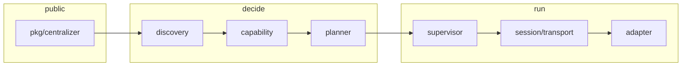

# Architecture

Centralizer is a single Go module. Subsystems have one job.

| Package | Responsibility |
| --- | --- |
| `pkg/centralizer` | Public Hub/Service API |
| `pkg/cir` | Intermediate representation |
| `pkg/schema` | Callable surface above CIR |
| `pkg/adapter` | Adapter interface and registry |
| `pkg/bridge` | Plan and Bridge contracts |
| `pkg/capability` | Capability graph |
| `pkg/health` | Health snapshots |
| `pkg/manifest` | Optional YAML configuration |
| `pkg/lockfile` | Optional resolved-plan snapshot |
| `pkg/czerr` | Typed errors |
| `pkg/diagnostics` | `doctor` checks |
| `internal/discovery` | Target analysis and fingerprints |
| `internal/planner` | Deterministic strategy selection |
| `internal/supervisor` | Lifecycle, recovery, circuit breaker |
| `internal/session` | Protocol client and native bridge |
| `internal/protocol` | Framing and messages |
| `internal/transport` | stdio, TCP, Unix, experimental SHM |
| `internal/security` | Paths, policy, env filtering |
| `internal/telemetry` | slog, in-process metrics and traces |
| `internal/registry` | Connected service table |
| `internal/cache` | Shim and plan cache |
| `internal/lifecycle` | Handles and shutdown |
| `internal/shim` | Embedded, versioned shim templates |
| `adapters/*` | Language-specific detect/connect only |

## Connect path

1. Validate the target path (unless `native:`).
2. Run every adapter's `Detect`. Keep scores; do not pretend certainty.
3. Ask the winning adapter for capabilities; add host facts that do not imply adapter support.
4. Plan under policy. Equivalent inputs produce the same ranking.
5. `Prepare` then `Connect`.
6. Wrap the bridge in a supervisor and register it.

## Ownership

The Hub owns services. A Service owns its supervisor. The supervisor owns the live Bridge. A stdio transport owns the child process and must kill it on `Close`. Handles never store foreign memory pointers.

## Extension

Register an `adapter.Adapter` with `centralizer.WithAdapter` or `Registry.Register`. A future protocol will allow out-of-process third-party adapters. Go plugins are not the extension mechanism.
