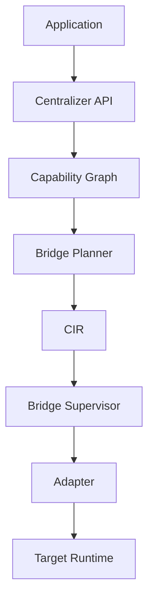
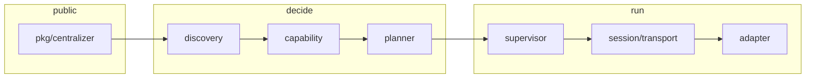

<p align="center">
  
</p>

<h1 align="center">CENTRALIZER</h1>
<p align="center"><strong>One runtime. Every language.</strong></p>

<p align="center">
  Centralizer is a Go-based interoperability runtime<br>
  that discovers, connects, supervises, and exposes<br>
  software written across different programming<br>
  languages through a unified interface.
</p>

<p align="center">
  <a href="https://github.com/theworker02/centralizer/actions/workflows/test.yml"></a>
  <a href="https://pkg.go.dev/github.com/theworker02/centralizer/pkg/centralizer"></a>
  <a href="https://goreportcard.com/report/github.com/theworker02/centralizer"></a>
  <a href="https://github.com/theworker02/centralizer/security/code-scanning"></a>
  <a href="LICENSE"></a>
  <a href="https://github.com/theworker02/centralizer/releases"></a>
  <a href="https://theworker02.github.io/centralizer/"></a>
  <a href="PRIVACY.md"></a>
</p>

```go
hub := centralizer.New()
service, err := hub.Connect(ctx, "./analytics")
if err != nil {
    panic(err)
}
result, err := service.Call(ctx, "calculate", centralizer.Args{
    "value": 42,
})
```

The calling application does not need to know which bridge Centralizer selected.

Module path: [`github.com/theworker02/centralizer`](https://pkg.go.dev/github.com/theworker02/centralizer).
Docs site: [theworker02.github.io/centralizer](https://theworker02.github.io/centralizer/).
License: [Apache 2.0](LICENSE). Privacy: [PRIVACY.md](PRIVACY.md).

## Contents

- [What Centralizer is](#what-centralizer-is)
- [What Centralizer is not](#what-centralizer-is-not)
- [Module identity](#module-identity)
- [Philosophy](#philosophy)
- [Architecture](#architecture)
- [Repository layout](#repository-layout)
- [Compatibility](#compatibility)
- [CIR](#cir)
- [Bridge planner](#bridge-planner)
- [Supervisor, recovery, circuit breaker](#supervisor-recovery-circuit-breaker)
- [Protocol 1.x](#protocol-1x)
- [Manifest, lock file, policy](#manifest-lock-file-policy)
- [Adapters](#adapters)
- [Installation](#installation)
- [Quickstart](#quickstart)
- [Library API](#library-api)
- [CLI](#cli)
- [Examples](#examples)
- [Errors](#errors)
- [Cache](#cache)
- [Security and trust](#security-and-trust)
- [Privacy](#privacy)
- [Observability](#observability)
- [Website](#website)
- [Brand assets](#brand-assets)
- [centralizerd](#centralizerd)
- [Versioning and releases](#versioning-and-releases)
- [Testing](#testing)
- [Contributing](#contributing)
- [License](#license)
- [Roadmap](#roadmap)
- [Document index](#document-index)

## What Centralizer is

Centralizer is a process-local orchestration layer. You point a Hub at a target directory or an in-process Go handler. The Hub:

1. Discovers language and runtime markers (`go.mod`, `pyproject.toml`, `package.json`, `Cargo.toml`, and the rest of the detect set).
2. Builds a capability graph (stdio, process, native, TCP, …).
3. Plans a bridge under an explicit policy.
4. Starts the selected adapter, converting values through CIR.
5. Supervises the live session: health, bounded recovery, circuit breaker.

It is a single Go module. Language-specific work lives in small adapters and generated shims. Planning, protocol, supervision, and CIR stay in the Go core.

v0.1 is a working vertical slice: a Go host, Python / Node / Rust process targets that tests exercise, CIR, a deterministic planner, a supervisor, and a CLI. Later languages are detect-only until invocation is tested. See [ROADMAP.md](ROADMAP.md).

Typical uses:

- A Go service that must call a local Python analytics module without writing a one-off RPC.
- A CLI that inspects a tree, explains why stdio beat TCP, and invokes one function.
- A host that registers an in-process Go handler (`native:name`) next to process-backed targets on the same Hub.
- A fixture-driven test that asserts planner ranking, CIR conversion, or supervisor quarantine.

## What Centralizer is not

- A language VM or interpreter. It does not execute Python bytecode or Java class files itself.
- A package manager. It does not install CPython, Node, or crates. Those runtimes must already be on `PATH` when you connect a process target.
- A general FFI / bindgen compiler. It does not generate C headers or rewrite foreign ABIs.
- A service mesh, remote RPC framework, or multi-host orchestrator. Remote `http(s):` and `file:` URLs are rejected in v0.1.
- A sandbox that makes untrusted code safe. Connecting a target runs that code locally. See [Security](#security-and-trust).
- A hosted product. There are no accounts and no Centralizer cloud. See [PRIVACY.md](PRIVACY.md).
- Complete polyglot coverage. Files under `adapters/` do not imply `Call`. The [compatibility matrix](#compatibility) is the claim.

## Module identity

| Item | Value |
| --- | --- |
| Module path | `github.com/theworker02/centralizer` |
| Go version | 1.23+ |
| Direct dependency | `gopkg.in/yaml.v3` only |
| Public API | `pkg/centralizer`, plus `pkg/cir`, `pkg/schema`, `pkg/adapter`, `pkg/bridge`, `pkg/capability`, `pkg/health`, `pkg/manifest`, `pkg/lockfile`, `pkg/czerr`, `pkg/diagnostics` |
| CLI | `cmd/centralizer` |
| Optional daemon | `cmd/centralizerd` |
| Protocol | Centralizer Protocol 1.0 (major 1) |
| pkg.go.dev | [module](https://pkg.go.dev/github.com/theworker02/centralizer), [Hub API](https://pkg.go.dev/github.com/theworker02/centralizer/pkg/centralizer) |
| Module proxy | `https://proxy.golang.org/github.com/theworker02/centralizer/` |

Pin a version in `go.mod` before 1.0. The public API and protocol may change. `@latest` follows the highest SemVer tag the proxy has seen.

This module is **not** part of `golang.org/x/*`. Those paths are reserved for the Go project. Publishing a tagged release makes **pkg.go.dev** and **proxy.golang.org** serve `github.com/theworker02/centralizer@vX.Y.Z`. That is the supported distribution path.

## Philosophy

Centralizer should never require the developer to manually solve an interoperability problem that Centralizer can reliably determine itself.

That sentence has limits. Automation that cannot be explained, reproduced, or bounded is not useful in a host process you have to debug. The design constraints are therefore:

- **Determinism.** Equivalent discovery input, capability graph, and policy produce the same ranking. Ties break on strategy name.
- **Explainability.** Every selection can be printed. `centralizer explain` and `Service.Explanation()` render the same planner report.
- **Honesty.** A capability is complete when tests demonstrate it. Detect-only adapters stay detect-only. Files existing under `adapters/` do not imply `Call`.
- **Bounds.** Recovery has a restart budget and exponential backoff. After the budget the target is quarantined. Infinite restart loops are a bug.
- **Policy over score.** A higher planner score cannot enable a denied transport, native execution, or subprocess.
- **One core.** Adapters detect and connect. They do not reimplement planning, supervision, or CIR.
- **Local by default.** The library does not phone home. The optional daemon binds loopback. Cache and doctor output stay on the machine.

When forced to choose, the project prefers stability over more languages, clear behavior over more abstraction, and debuggable automation over automatic magic. See [DESIGN.md](DESIGN.md).

## Architecture



Centralizer is a single Go module. Each package has one job.

| Package | Responsibility |
| --- | --- |
| `pkg/centralizer` | Public Hub / Service API |
| `pkg/cir` | Kind-tagged intermediate values |
| `pkg/schema` | Callable surface above CIR; explicit YAML load |
| `pkg/adapter` | Adapter interface, registry, catalog |
| `pkg/bridge` | Plan, Bridge, Stream contracts |
| `pkg/capability` | Capability graph |
| `pkg/health` | Supervisor snapshots |
| `pkg/manifest` | Optional `centralizer.yaml` |
| `pkg/lockfile` | Optional resolved-plan snapshot |
| `pkg/czerr` | Typed errors (`errors.Is` / `errors.As`) |
| `pkg/diagnostics` | `doctor` checks |
| `internal/discovery` | Target analysis and fingerprints |
| `internal/planner` | Deterministic strategy selection |
| `internal/supervisor` | Lifecycle, recovery, circuit breaker |
| `internal/session` | Protocol client and native bridge |
| `internal/protocol` | Framing and messages |
| `internal/transport` | stdio, TCP, Unix, named-pipe client, experimental SHM |
| `internal/security` | Paths, policy, environment filtering |
| `internal/telemetry` | slog, in-process metrics and traces |
| `internal/registry` | Connected service table |
| `internal/cache` | Shim and plan cache |
| `internal/lifecycle` | Handles and shutdown |
| `internal/shim` | Embedded, versioned shim templates |
| `internal/version` | SemVer and protocol identity |
| `adapters/*` | Language-specific detect / connect only |



### Connect path

1. Validate the target path (unless `native:`). Remote `http(s):` and `file:` URLs are rejected in v0.1. Null bytes are rejected. The path must exist after `Abs`+`Clean`.
2. Run every adapter's `Detect`. Keep confidence scores; do not pretend certainty. Ambiguous trees are reported, not hidden.
3. Ask the winning adapter for capabilities. Host facts (OS sockets) do not imply the adapter can connect that way.
4. Plan under policy. Equivalent inputs produce the same ranking. Policy can reject a candidate; `bench` cannot override that.
5. `Prepare` then `Connect`. Prepare may materialize a cache-resident shim if policy allows generated code.
6. Load an explicit schema if `schema.yaml` or a manifest `schema:` field is present.
7. Wrap the bridge in a supervisor and register it on the Hub.

`Hub.Analyze` stops after discovery and planning. `Hub.Explain` returns the same report the CLI prints. `Hub.LockPlan` writes the resolved snapshot without requiring a live call.

### Ownership

The Hub owns services. A Service owns its supervisor. The supervisor owns the live Bridge. A stdio or TCP transport owns the child process and must kill it on `Close`. Handles never store foreign memory pointers. `Service.Close` drops locally tracked handles for that bridge (`DropBridge`) and reaps children. `Hub.Close` closes every registered service.

Do not leak a Service across Hub lifetime. A CLI invocation constructs a new Hub; that is why `list` and `health` without a long-lived process cannot see services started by another command.

### Isolation

Default policy isolation is `process`: the target runs in a child (or as a registered in-process handler if you asked for `native:` and policy allows it). Centralizer is not a seccomp/jail/container runtime. Process isolation means a separate OS process and a filtered environment, not a security sandbox. Shared memory is typed but disabled (`ErrExperimental`).

See [ARCHITECTURE.md](ARCHITECTURE.md) for subsystem notes.

## Repository layout

```text
centralizer/
  pkg/                 public Go API
  internal/            planner, supervisor, protocol, transport, cache
  adapters/            language detect/connect (one directory per runtime)
  cmd/centralizer      CLI
  cmd/centralizerd     optional loopback daemon
  examples/            fixtures used by docs and tests
  tests/               integration and failure injection
  protocol/            Protocol 1.0 text
  website/             Vite + React docs site
  assets/              canonical logo and icons
  packages/centralizer-brand   npm-shaped brand package sources
  .github/workflows    test, lint, race, fuzz, CodeQL, Pages, release
```

Root markdown files (`ARCHITECTURE.md`, `CIR.md`, `PROTOCOL.md`, …) are canonical so GitHub renders them immediately. The website restates a subset.

## Compatibility

Only mark a capability complete when tests demonstrate it. Detect-only languages stay detect-only.

| Runtime | Detect | Call | Stream | Handles | Native | Process | WASM |
| --- | --- | --- | --- | --- | --- | --- | --- |
| Go | Yes | Yes | Planned | Yes | Yes | Yes | Planned |
| Python | Yes | Yes | Yes | Yes | N/A | Yes | N/A |
| Node.js | Yes | Yes | Yes | Planned | N/A | Yes | N/A |
| Rust | Yes | Yes* | Planned | Planned | Planned | Yes | Planned |
| C / C++ | Yes | No | No | No | Planned | Planned | Planned |
| WebAssembly | Yes | No | No | No | N/A | N/A | Planned |
| JVM / .NET / Ruby / PHP | Yes | No | No | No | No | Planned | No |
| Swift / Dart / Lua / Zig | Yes | No | No | No | No | Planned | No |

\* Rust invocation requires a target that speaks [Centralizer Protocol 1.x](PROTOCOL.md) on stdio (`cargo run -- --centralizer` or an existing binary). Centralizer does not compile arbitrary Rust into a shim in v0.1.

`centralizer adapters` prints name, tier, whether invocation is implemented, and claimed capabilities. Foundation adapters (C, C++, WASM, JVM, .NET, Ruby, PHP, Swift, Dart, Lua, Zig) detect only; `Connect` returns `ErrNotImplemented`.

Windows notes that are true in this tree:

- Named-pipe **client** dial exists. The server side remains experimental.
- Doctor on Windows reports the named-pipe client foundation instead of “planned”.
- `splitRef` treats a Windows drive prefix (`C:`) as a path, not as a scheme.
- Shared memory is experimental and disabled on every OS.

Unix domain sockets are scored when the host and adapter claim them. They are not the portable default; stdio is.

## CIR

[CIR](CIR.md) is the semantic boundary between languages. Adapters convert native values into CIR and back. They do not invent a second type system. Values are kind-tagged; they are not stored as an untyped `any` bag.

| Kind | Storage | Notes |
| --- | --- | --- |
| null | — | |
| boolean | `num` 0/1 | |
| int | `num` as int64 bits | overflow checked on convert |
| uint | `num` | |
| float | `num` as float64 bits | non-finite rejected by schema validate |
| decimal | `str` | exact decimal text |
| string | `str` | |
| bytes | `raw` | |
| array / tuple | `items` | |
| map / struct | `keys` + `items` | |
| enum | `str` + discriminant | |
| union | tag + inner | |
| optional | flag + inner | |
| result | ok flag + inner | |
| error | code + message | |
| timestamp | unix nanos | UTC |
| duration | nanos | |
| UUID | 16 bytes | |
| stream | id | |
| handle | id | never a foreign pointer |
| opaque | tag + payload | language-specific |

Optional `Meta` carries type name, language, and schema id.

Wire JSON is kind-tagged. Do not decode CIR by guessing JSON types.

```json
{"k":"int","i":42}
{"k":"map","m":[{"k":"value","v":{"k":"int","i":42}}]}
```

Go uses `cir.From` / `Value.Native`. The Python shim maps `int`→int, `float`→float, `str`→string, `bytes`→bytes, `dict`→map, `list`→array. The Node shim maps integer `number`→int, otherwise float; `Buffer`→bytes; object→map.

Schemas sit above CIR. Inferred schemas do not enforce argument types. An explicit `schema.yaml` (or manifest `schema:`) does, including unknown-function rejection. Schema validate also rejects non-finite floats.

Handles are correlation ids. They never store a pointer into another runtime’s heap. `WithHandleTTL` expires locally tracked ids; unknown ids are still forwarded to the peer. `Service.Close` calls `DropBridge` so ids from a dead bridge cannot be reused by accident.

## Bridge planner

The planner scores strategies on fixed integer weights. Scores are 0–100. Ties break on strategy name so equivalent inputs produce the same ranking.

| Dimension | Weight |
| --- | --- |
| compatibility | 16 |
| reliability | 14 |
| isolation | 14 |
| performance | 12 |
| security | 12 |
| serialization | 8 |
| startup | 6 |
| portability | 6 |
| debuggability | 6 |
| availability | 6 |

Evaluated strategies:

| Strategy | Transport | Typical use |
| --- | --- | --- |
| in-process | `native` | Registered Go handlers (`native:name`) |
| Unix socket | `unix_socket` | Persistent process IPC on non-Windows hosts when the adapter claims the capability |
| named pipe | `named_pipe` | Windows local IPC; client dial exists, server side is experimental |
| stdio | `stdio` | Supervised child, NDJSON protocol — the portable default |
| TCP | `tcp` | Localhost length-prefixed frames when `prefer: [tcp]` and policy allows loopback |
| WASM | `wasm` | Planned invocation; detect-only in v0.1 |
| shared memory | `shared_memory` | Types exist; disabled (`ErrExperimental`) |

How selection works:

1. Discover markers.
2. Score language/runtime hypotheses. Ambiguity is reported, not hidden.
3. Build a capability graph.
4. Score strategies. Policy can reject a candidate; it cannot be overridden by `bench`.
5. Select the highest viable score. Record fallbacks.
6. Explain the decision.

```bash
centralizer explain ./examples/go-python/analytics
```

Manifest `prefer` may boost a listed strategy by a small integer. It cannot enable a policy-denied one. Policy always wins over a higher benchmark score.

`centralizer bench` reports planner scores for viable strategies. It does not start a timed shoot-out that rewrites policy. Published numbers must include machine, OS, versions, transport, and payload size. See [BENCHMARKS.md](BENCHMARKS.md).

`bridge.TransportName` maps planner strategy identifiers to transport labels so supervisor fallback reconnects `in_process` as `native`, not as a nonexistent transport named `in_process`.

## Supervisor, recovery, circuit breaker

External bridges are supervised:

`created → starting → healthy → degraded → recovering → unhealthy → quarantined → stopping → stopped`

On a recoverable error (`ErrBridgeFailed`, `ErrTransportFailure`, `ErrTimeout`) the supervisor:

1. Marks the service recovering.
2. Waits with exponential backoff (default 200 ms, capped at 5 s).
3. Rebuilds the bridge through the adapter factory.
4. If rebuild fails, tries the first recorded fallback, mapping strategy → transport correctly (`in_process` → `native`, not the raw strategy string).
5. Increments the restart counter. Default budget is 5 (`policy.max_restarts`).
6. Quarantines the target when the budget is exhausted (`ErrQuarantined`).

The circuit breaker trips after consecutive failures (default 5), stays open for 5 s, then admits a half-open probe. Two successes close it. An open breaker returns `ErrCircuitOpen` so a broken dependency cannot livelock the host.

`WithAutoRecovery(false)` disables rebuilds. Native in-process handlers do not tear down a child process; process crash recovery is exercised in `tests/failure`.

Health snapshots include state, transport, latency, success rate, restarts, fallbacks, last error, and breaker state. `Service.Health()` and `Hub.Health()` expose them. `centralizer health <target>` connects, prints one snapshot, and closes.

## Protocol 1.x

Handshake negotiates `protocol: "1.0"`. Major version 1 is required. Unknown message types return `ERROR`. A 1.x peer may ignore unknown optional fields. A 2.x peer must not claim 1.x compatibility without a documented translation.

| Transport | Framing |
| --- | --- |
| stdio | NDJSON, one message per line |
| TCP / Unix | 4-byte big-endian length + JSON body |
| memory (tests) | same as TCP |

Maximum frame size: 16 MiB (`protocol.MaxFrameBytes`). Oversized frames surface as `ErrPayloadTooLarge` / `ErrFrameInvalid`.

Envelope:

```json
{"v":1,"id":"corr-id","type":"CALL","payload":{}}
```

`id` is a correlation identifier. Responses reuse it.

| Type | Direction | Purpose |
| --- | --- | --- |
| HELLO | both | version and feature negotiation |
| CAPABILITIES | peer → host | optional capability list |
| DESCRIBE / DESCRIBE_OK | both | schema YAML |
| CALL | host → peer | function or method |
| RESULT | peer → host | CIR value |
| ERROR | either | structured error (`schema`, `conversion`, `handle`, `timeout`, `cancel`, `adapter`, `protocol`, `frame`) |
| STREAM_OPEN / STREAM_DATA / STREAM_CLOSE | both | streams |
| HANDLE_CREATE / HANDLE_RELEASE | both | opaque objects |
| GET / SET | host → peer | properties |
| HEARTBEAT | both | liveness |
| CANCEL | host → peer | abort `id` |
| SHUTDOWN | host → peer | graceful exit |
| OK | peer → host | empty success |

CALL arguments are CIR wire values, not raw JSON types:

```json
{"v":1,"id":"2","type":"CALL","payload":{"function":"calculate","args":{"value":{"k":"int","i":42}}}}
```

Python generators and Node iterables are streamed by the generated shims (`STREAM_OPEN` / `STREAM_DATA` / `STREAM_CLOSE`). Go native streaming is still planned.

Full text: [PROTOCOL.md](PROTOCOL.md), [protocol/v1.md](protocol/v1.md).

## Manifest, lock file, policy

Zero configuration is valid. A manifest exists for deterministic overrides.

`centralizer init` writes `centralizer.yaml` (refuses to overwrite unless `--force`):

```yaml
centralizer:
  version: 1
services:
  analytics:
    source: ./examples/go-python/analytics
    language: auto
    schema: schema.yaml
  engine:
    source: ./examples/go-rust/engine
    language: rust
    prefer:
      - stdio
policy:
  recovery: automatic
  isolation: process
  tracing: true
  native_execution: true
  network: localhost_only
  subprocesses: true
```

Load it in-process with `centralizer.LoadManifest` and `WithManifest`. Service entries can override source, language, entry, prefer list, and schema path.

Policy fields that the engine actually enforces:

| Field | Effect |
| --- | --- |
| `native_execution` | Allows or denies in-process Go handlers |
| `subprocesses` | Allows or denies child processes |
| `generated_code` | Allows or denies shim materialization |
| `network` | `localhost_only` (default), or `none` to reject TCP |
| `allowed_runtimes` | Adapter-name allow-list (empty = all) |
| `allowed_transports` | Transport-name allow-list (empty = all) |
| `max_restarts` | Supervisor budget (default 5) |

Default policy (when you pass nothing) is recovery `automatic`, isolation `process`, network `localhost_only`. Empty allow-lists mean “all”. A denied runtime or transport returns `ErrPolicyDenied` before a child starts.

`centralizer lock <target> [path]` writes `centralizer.lock`: adapter, transport, strategy, fingerprint, scores, reasons. Connect does not require a lock file. `inspect` reads `centralizer.lock` or `<target>.lock` when present and reports `lock_matches` against the live plan. A lock file is a snapshot for review and CI drift detection, not a substitute for policy.

## Adapters

Adapters implement detect / capabilities / prepare / connect. They must not implement planning, supervision, or CIR.

```go
type Adapter interface {
    Name() string
    Detect(context.Context, Target) (Detection, error)
    Capabilities(context.Context, Target) ([]capability.Capability, error)
    Prepare(context.Context, Target) error
    Connect(context.Context, Target, bridge.Plan) (bridge.Bridge, error)
}
```

Built-in adapters are registered by `centralizer.New()`. Additional adapters:

```go
hub := centralizer.New(centralizer.WithAdapter(myAdapter))
```

Do not use Go's plugin system as the extension mechanism. A later revision will speak the protocol to out-of-process third-party adapters.

Generated shims (Python, Node) are templates, versioned, hashed into the cache key, and written with restrictive permissions into a private cache. They are not copied into user trees. They implement protocol speak and module loading only.

Adapter tiers, stated honestly:

| Tier | Runtimes | Invocation |
| --- | --- | --- |
| Host | Go native handlers | Yes (`native:name`, in-process) |
| Process + shim | Python, Node | Yes, generated stdio shims |
| Process + protocol | Rust | Yes, if the binary speaks Protocol 1.x on stdio |
| Detect-only | C, C++, WASM, JVM, .NET, Ruby, PHP, Swift, Dart, Lua, Zig | No |

See [ADAPTERS.md](ADAPTERS.md), [docs/sdk.md](docs/sdk.md), and `adapters/*/README.md`.

## Installation

Requires Go 1.23+. The library dependency graph is the Go standard library plus `gopkg.in/yaml.v3`.

### Library

```bash
go get github.com/theworker02/centralizer/pkg/centralizer@v0.1.2
```

Or `@latest` once you accept moving with new 0.x tags. Pinning is safer before 1.0.

```go
import "github.com/theworker02/centralizer/pkg/centralizer"
```

### CLI

```bash
go install github.com/theworker02/centralizer/cmd/centralizer@v0.1.2
```

Confirm:

```bash
centralizer version
# centralizer 0.1.2 (protocol 1.0)
```

### Optional daemon

```bash
go install github.com/theworker02/centralizer/cmd/centralizerd@v0.1.2
```

### From a clone

```bash
git clone https://github.com/theworker02/centralizer.git
cd centralizer
go test ./...
make build
```

`make build` writes `bin/centralizer` and `bin/centralizerd` with the module version via `-ldflags`.

Release archives (Linux, macOS, Windows amd64/arm64 except Windows arm64) are produced by GoReleaser when a `v*` tag is pushed. See [GitHub Releases](https://github.com/theworker02/centralizer/releases).

### Module proxy

The public Go module proxy serves tagged versions:

```bash
GOPROXY=https://proxy.golang.org go list -m github.com/theworker02/centralizer@v0.1.2
```

pkg.go.dev: [https://pkg.go.dev/github.com/theworker02/centralizer@v0.1.2](https://pkg.go.dev/github.com/theworker02/centralizer@v0.1.2)

Indexing can take a few minutes after the first proxy fetch. You cannot publish this module under `golang.org/x/`; that namespace is not ours.

To avoid the public proxy (air-gapped or vendor-only):

```bash
GOPROXY=off go list -m github.com/theworker02/centralizer@v0.1.2
```

or vendor the module in your repository.

### Brand package

```bash
npm install @theworker02/centralizer-brand
```

The package is the official mark only. It is not a JavaScript runtime. Publishing to the npm registry is a separate step; this repository ships the package sources under `packages/centralizer-brand/`.

### Host toolchains

| Target | Required on PATH for Call |
| --- | --- |
| Go native | none beyond the host process |
| Python | `python` / `python3` (CPython) |
| Node | `node` |
| Rust protocol binary | `cargo` to build the example; or a prebuilt speaker |
| Detect-only languages | nothing for `detect`; `Connect` is not implemented |

`centralizer doctor` reports which of these are present.

## Quickstart

```go
package main

import (
    "context"
    "fmt"

    "github.com/theworker02/centralizer/pkg/centralizer"
)

func main() {
    ctx := context.Background()
    hub := centralizer.New()
    analytics, err := hub.Connect(ctx, "./analytics")
    if err != nil {
        panic(err)
    }
    defer analytics.Close(ctx)

    result, err := analytics.Call(ctx, "calculate", centralizer.Args{
        "value": 42,
    })
    if err != nil {
        panic(err)
    }
    fmt.Println(result)
}
```

Point Centralizer at `examples/go-python/analytics` to run this against a real Python module (CPython must be on `PATH`).

CLI equivalent:

```bash
centralizer detect ./examples/go-python/analytics
centralizer explain ./examples/go-python/analytics
centralizer call ./examples/go-python/analytics calculate value=21
```

`call` coerces `k=v` tokens: `true`/`false`, integers, floats, otherwise strings.

A slightly broader walk:

```bash
centralizer doctor
centralizer adapters
centralizer inspect ./examples/go-python/analytics
centralizer describe ./examples/go-python/analytics
centralizer lock ./examples/go-python/analytics
centralizer call ./examples/go-node/service report name=demo
centralizer call ./examples/go-rust/engine multiply a=6 b=7
```

Rust example requires `cargo` and a protocol-speaking binary. Node and Python examples require those interpreters.

## Library API

Construct a Hub, optionally with options. `New` never starts `centralizerd`.

```go
hub := centralizer.New(
    centralizer.WithAutoRecovery(true),
    centralizer.WithTracing(true),
    centralizer.WithTimeout(30*time.Second),
    centralizer.WithHandleTTL(time.Hour),
    centralizer.WithCacheDir(""), // default user cache
    centralizer.WithLogger(slog.Default()),
    centralizer.WithLanguage("auto"),
    centralizer.WithPrefer("stdio"),
    centralizer.WithManifest(m),
    centralizer.WithPolicy(m.Policy),
    centralizer.WithAdapter(myAdapter),
)
```

Register an in-process Go handler and connect it as `native:math`:

```go
hub.RegisterNative(&session.Handler{
    Name: "math",
    Funcs: map[string]session.Func{
        "calculate": func(_ context.Context, args map[string]cir.Value) (cir.Value, error) {
            n, err := args["value"].Int()
            if err != nil {
                return cir.Value{}, err
            }
            return cir.Int(n * 2), nil
        },
    },
})

svc, err := hub.Connect(ctx, "native:math")
```

Service surface:

```go
_ = svc.Language()
_ = svc.Runtime()
_ = svc.Transport()
_ = svc.Plan()
_ = svc.Health()
_ = svc.Explanation()
_ = svc.Capabilities()

result, err := svc.Call(ctx, "calculate", centralizer.Args{"value": 21})
result, err = svc.Invoke(ctx, bridge.Invocation{Function: "calculate", Args: cirArgs})

st, err := svc.Stream(ctx, "count_up", centralizer.Args{"n": 4})
sub, err := svc.Subscribe(ctx, "events")

h, err := svc.New(ctx, "Session", nil)
id, err := h.HandleID()
_ = svc.Get(ctx, id, "name")
_ = svc.Set(ctx, id, "name", "demo")
_ = svc.Release(ctx, id)

sc, err := svc.Describe(ctx)
```

Hub surface:

```go
text, plan, err := hub.Explain(ctx, "./analytics")
analysis, err := hub.Analyze(ctx, "./analytics")
lf, err := hub.LockPlan(ctx, "./analytics")
_ = hub.Adapters()
_ = hub.AdapterCatalog()
_ = hub.List()
_ = hub.Health()
_ = hub.Cache()
_ = hub.Close(ctx)
```

Public APIs do not panic for ordinary failures. `Call` converts `Args` through CIR and, when an explicit schema is loaded, validates function name and argument types. `WithTimeout` applies only when the context has no deadline. `WithHandleTTL` expires locally tracked handles; unknown ids are still forwarded to the remote.

Connect options can be passed per call: `hub.Connect(ctx, ref, centralizer.WithEntry("model.py"), centralizer.WithLanguage("python"))`.

Reference: [pkg.go.dev/github.com/theworker02/centralizer/pkg/centralizer](https://pkg.go.dev/github.com/theworker02/centralizer/pkg/centralizer).

## CLI

```text
centralizer detect <target>
centralizer inspect <target>
centralizer describe <target>
centralizer connect <target>
centralizer call <target> <function> [k=v...]
centralizer health <target>
centralizer list
centralizer graph <target>
centralizer explain <target>
centralizer bench <target>
centralizer trace <target>
centralizer doctor
centralizer cache list|clear
centralizer init [--force] [path]
centralizer lock <target> [path]
centralizer adapters
centralizer version
```

| Command | Behavior |
| --- | --- |
| `detect` | Score language/runtime hypotheses without connecting |
| `inspect` | Analysis + plan; includes lock comparison when a lock file exists |
| `describe` | Connect, print inferred or declared schema |
| `connect` | Establish a bridge and print health, then close |
| `call` | Connect, invoke, print the native result |
| `health` | Connect (or report that this process has no long-lived services) |
| `list` | Registered adapter names |
| `graph` | Capability graph summary |
| `explain` | Human-readable planner report |
| `bench` | Planner scores for viable strategies; does not override policy |
| `trace` | Connect with in-process spans; print elapsed / adapter / transport |
| `doctor` | Host toolchain, cache writability, Git, protocol version, adapters |
| `cache` | List or clear generated shim artifacts |
| `init` | Write a starter `centralizer.yaml` |
| `lock` | Write a resolved-plan `centralizer.lock` |
| `adapters` | Name, tier, invocation flag, claimed capabilities |
| `version` | SemVer and protocol (`centralizer 0.1.2 (protocol 1.0)`) |

`--json`, `--quiet` / `-q`, and `--verbose` / `-v` apply to every command. `--json` plus `--verbose` emits machine-readable slog lines.

Each CLI invocation constructs a new Hub. `list` and `health` without a long-lived process therefore cannot see services started by another command. Use the library or `centralizerd` if you need a process-wide table.

Exit status is non-zero on typed errors (target missing, policy denied, not implemented, quarantine, …). Prefer `--json` in scripts.

## Examples

| Path | What it demonstrates |
| --- | --- |
| `examples/go-python` | Discovery + CIR call into CPython (`calculate`) |
| `examples/go-node` | Discovery + CIR call into Node.js (`report`) |
| `examples/go-rust` | Protocol-speaking Rust engine (`multiply`) |
| `examples/go-c` / `examples/go-cpp` | Detection only (invocation not implemented) |
| `examples/go-wasm` | Detection notes for `.wasm` |
| `examples/showcase` | One Hub across Python, Rust, and Node |
| `examples/streaming` | Python generator via `STREAM_*` |
| `examples/recovery` | Health / error surface on a native handler |
| `examples/object-handles` | Python `HANDLE_CREATE` / `Release` |

Run from the example directory or the repository root. Python and Node must be on `PATH`. Rust examples need `cargo`. See [examples/README.md](examples/README.md).

The Python analytics fixture doubles an integer. The Node fixture returns a small report map. The Rust fixture multiplies two integers over Protocol 1.x. Treat them as contract tests, not as a framework for production business logic.

## Errors

Callers should use `errors.Is` / `errors.As` against `pkg/czerr` sentinels. Do not match on message strings.

| Sentinel | Typical cause |
| --- | --- |
| `ErrTargetNotFound` | Path missing after resolve |
| `ErrUnsupportedTarget` | No adapter claimed the tree |
| `ErrNotImplemented` | Detect-only adapter; Connect refused |
| `ErrRuntimeUnavailable` | Interpreter or toolchain missing |
| `ErrPolicyDenied` | Native, subprocess, transport, or network blocked |
| `ErrConversion` | CIR / native conversion failed |
| `ErrSchemaMismatch` / `ErrSchemaInvalid` | Explicit schema rejected the call |
| `ErrTimeout` / `ErrCancelled` | Deadline or context cancel |
| `ErrBridgeFailed` / `ErrTransportFailure` | Live session died |
| `ErrQuarantined` | Restart budget exhausted |
| `ErrCircuitOpen` | Breaker open |
| `ErrHandleInvalid` | Unknown or expired handle |
| `ErrPayloadTooLarge` / `ErrFrameInvalid` | Protocol limits |
| `ErrExperimental` | Shared memory (and similar) disabled |
| `ErrSecurity` | Path / environment violation |
| `ErrClosed` | Use after Close |

`czerr.Error` may carry a `Detail` map for diagnostics. `czerr.Detail(err)` returns it.

## Cache

Default root: `filepath.Join(os.UserCacheDir(), "centralizer")`.

| Platform | Typical path |
| --- | --- |
| Windows | `%LocalAppData%\centralizer` |
| macOS | `~/Library/Caches/centralizer` |
| Linux | `$XDG_CACHE_HOME/centralizer` or `~/.cache/centralizer` |

Directories are `0700`, files `0600`. Shim templates are hashed into the cache key so a version bump invalidates old shims. `WithCacheDir` overrides the root. `centralizer cache list` and `centralizer cache clear` operate only on this store. Nothing in the cache is uploaded. See [PRIVACY.md](PRIVACY.md).

## Security and trust

Discovered code is not trusted merely because Centralizer found it. A target may be an unreviewed project, a shared library, or a local service. Centralizer's job is to reach it under an explicit policy, not to attest that it is safe.

The host application is the trust boundary. Centralizer will start child processes, generate disposable shims into a private cache, and exchange protocol frames with those processes. Treat connected targets as you would any local executable you chose to run.

Controls that exist in this tree:

- Path validation (`ResolveTarget`): null bytes rejected; `http(s):` and `file:` rejected; target must exist after `Abs`+`Clean`.
- Environment filtering on child processes (`LD_PRELOAD`, `LD_LIBRARY_PATH`, `DYLD_*`, `PYTHONINSPECT`, `NODE_OPTIONS`).
- Payload size limit (16 MiB frames).
- Handle validation and optional TTL; handles are ids, not foreign pointers.
- Policy allow-lists for runtimes and transports.
- `centralizerd` binds loopback and rejects non-loopback peers.

Report unpatched vulnerabilities privately via GitHub Security Advisories. Do not open a public issue. See [SECURITY.md](SECURITY.md).

## Privacy

Centralizer is local software. It does not require accounts. It does not ship analytics or telemetry to the authors by default. Doctor output and the cache stay on the machine. Optional `centralizerd` is localhost-only. Connecting a target runs that code locally; that is your responsibility.

If you clone from GitHub or resolve the module through the public Go proxy, those operators are third parties. Details: [PRIVACY.md](PRIVACY.md).

## Observability

### Doctor

`centralizer doctor` inspects the host: Go toolchain, Python, Node, Cargo, OS sockets, shared-memory warning (experimental / disabled), cache directory writability, Git on `PATH`, protocol version parse, and registered adapter names. The report is local. It is not sent to the authors.

### Telemetry

`internal/telemetry.DefaultMetrics` records calls, errors, timeouts, bytes, bridge restarts, streams, runtime startups, planner decisions, and a bounded latency sample. `Snap()` exports JSON-friendly p50/p99.

There is no required OpenTelemetry dependency. A host may scrape `Snap()` into its own Meter. `WithTracing(true)` records an in-process span tree used by `centralizer trace`; that tracer is not an OTLP exporter.

Structured logs use `log/slog`. `WithLogger` replaces the default. See [docs/telemetry.md](docs/telemetry.md).

## Website

Documentation site sources live in [`website/`](website/) (Vite, React, TypeScript). Vite `base` is `./`, so the same `dist/` works locally and on GitHub project Pages.

Published site: [theworker02.github.io/centralizer](https://theworker02.github.io/centralizer/)

Privacy page on the site: [theworker02.github.io/centralizer/#privacy](https://theworker02.github.io/centralizer/#privacy)

```bash
cd website
npm install
npm run dev
```

`make website` runs the production build. Enable Pages with **Settings → Pages → Source: GitHub Actions** (`.github/workflows/pages.yml`). There is no custom domain / CNAME.

The site copies `assets/logo.svg` and `assets/icon.svg` into `website/public` at build start so the hero, nav, and favicon cannot drift from the canonical mark.

## Brand assets

`assets/` is the single source of truth:

| File | Use |
| --- | --- |
| `assets/logo.svg` | Canonical mark (hub + converging paths / copper node) |
| `assets/logo-dark.svg` | Dark-background variant |
| `assets/logo-light.svg` | Light-background variant |
| `assets/icon.svg` | Compact icon / favicon |
| `assets/icon-256.png`, `assets/icon-512.png` | Raster icons |
| `assets/github-social-preview.png` | GitHub social preview (1280×640) |

README, the documentation site, and `@theworker02/centralizer-brand` all use these files. Do not introduce a one-off drawing. Upload `assets/github-social-preview.png` in repository settings for the social preview. See [docs/github-metadata.md](docs/github-metadata.md).

## centralizerd

`centralizerd` is optional. Ordinary library use does not start a daemon. `centralizer.New()` never launches it.

When run, it listens on loopback only (default `127.0.0.1:4780`) and exposes:

| Path | Purpose |
| --- | --- |
| `GET /healthz` | Version and protocol |
| `GET /v1/adapters` | Registered adapter names |
| `GET /v1/services` | In-process service table |
| `GET /v1/doctor` | Doctor report |
| `GET /v1/metrics` | `DefaultMetrics.Snap()` JSON |
| `POST /v1/register` | Connect a source into this process |

Do not bind it to a public interface. Non-loopback peers receive 403.

## Versioning and releases

Centralizer follows [Semantic Versioning](https://semver.org/). The public API is **not stable before 1.0**. A 0.x release may change Hub options, error text (not sentinels, when we can avoid it), CLI flags, and detect heuristics.

| Channel | Meaning |
| --- | --- |
| `internal/version.Version` | SemVer string compiled into the binaries (`Makefile` `VERSION` / GoReleaser ldflags) |
| `internal/version.Protocol` | Protocol major.minor spoken at HELLO (`1.0`) |
| Git tag | `vMAJOR.MINOR.PATCH` on `main` only |
| GitHub Release | Notes from [CHANGELOG.md](CHANGELOG.md); archives from GoReleaser |
| pkg.go.dev / proxy.golang.org | Indexed from the same tag |

Release process used by this repository:

1. Update `CHANGELOG.md`, `internal/version.Version`, and `Makefile` `VERSION`.
2. Commit to `main` (this repository does not use `master`).
3. Push an annotated tag `vX.Y.Z`.
4. `.github/workflows/release.yml` runs GoReleaser on `v*` tags.
5. The first `go list -m` / proxy `/.info` fetch makes `proxy.golang.org` cache the module.

Changelog format: [Keep a Changelog](https://keepachangelog.com/en/1.1.0/). Security fixes target the latest `0.x` until 1.0. See [SECURITY.md](SECURITY.md).

Do not declare v1.0.0 until the Hub API, protocol, and adapter matrix are intentionally frozen.

## Testing

```bash
go test ./...
go test -race ./...
make lint
make fuzz
make bench
```

| Area | Location |
| --- | --- |
| Unit | next to packages (`pkg/*`, `internal/*`) |
| Integration | `tests/` and `examples/` |
| Failure injection | `tests/failure` |
| Fuzz | CIR decode, manifest parse, schema YAML, NDJSON, frames |
| Benchmarks | `benchmarks/`, `pkg/cir`, `internal/protocol` |

CI workflows: `test.yml`, `lint.yml`, `race.yml`, `fuzz.yml`, `benchmarks.yml`, `codeql.yml`. Do not mark a language or transport complete unless CI exercises it.

## Contributing

See [CONTRIBUTING.md](CONTRIBUTING.md). Adapter authors are welcome; the public `adapter.Adapter` interface is the extension point.

```bash
go test ./...
gofmt -w .
make lint
```

Use conventional commits (`feat`, `fix`, `docs`, `test`, `chore`, `refactor`). Do not mark a language or transport complete unless CI exercises it. Do not add dependencies unless the standard library is insufficient. Participants follow [CODE_OF_CONDUCT.md](CODE_OF_CONDUCT.md).

Pull requests target `main`. Support channels: [SUPPORT.md](SUPPORT.md).

## License

Apache License 2.0. See [LICENSE](LICENSE) and [NOTICE](NOTICE).

You may use, modify, and distribute the software under that license. There is no CLA. Contributions are accepted under the same terms.

## Roadmap

v0.1 is a working vertical slice: Go host, Python / Node / Rust process targets, CIR, planner, supervisor, and CLI. Streaming shims, lock files, explicit schemas, and localhost TCP are available in this tree. Later phases add C/WASM invocation, JVM/.NET, shared memory, and a multi-process daemon registry.

Do not treat later phases as implemented because files exist. See [ROADMAP.md](ROADMAP.md) and [CHANGELOG.md](CHANGELOG.md).

## Document index

| Document | Topic |
| --- | --- |
| [ARCHITECTURE.md](ARCHITECTURE.md) | Subsystems and ownership |
| [DESIGN.md](DESIGN.md) | Decisions |
| [CIR.md](CIR.md) | Intermediate representation |
| [PROTOCOL.md](PROTOCOL.md) | Wire protocol |
| [ADAPTERS.md](ADAPTERS.md) | Adapter SDK |
| [BENCHMARKS.md](BENCHMARKS.md) | Measurement rules |
| [ROADMAP.md](ROADMAP.md) | Phases |
| [SECURITY.md](SECURITY.md) | Trust model and reporting |
| [PRIVACY.md](PRIVACY.md) | What is and is not collected |
| [CHANGELOG.md](CHANGELOG.md) | Released versions |
| [CONTRIBUTING.md](CONTRIBUTING.md) | Development |
| [SUPPORT.md](SUPPORT.md) | Issues and discussions |
| [CODE_OF_CONDUCT.md](CODE_OF_CONDUCT.md) | Conduct |
| [docs/telemetry.md](docs/telemetry.md) | In-process metrics |
| [docs/sdk.md](docs/sdk.md) | Adapter helpers |
| [docs/github-metadata.md](docs/github-metadata.md) | Social preview and topics |
